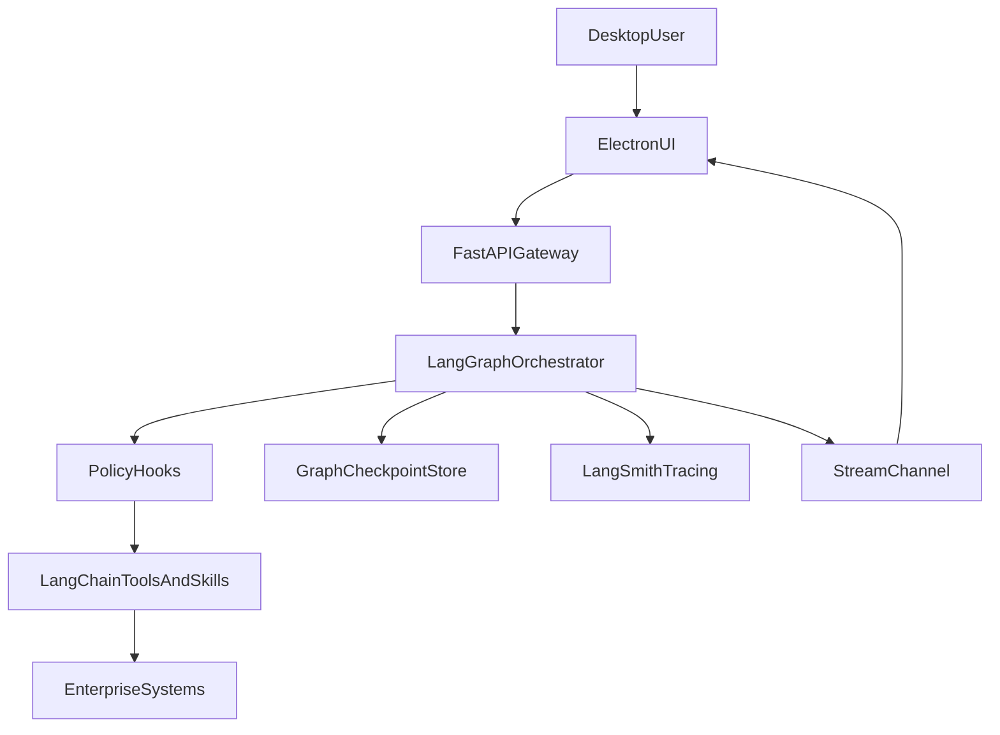
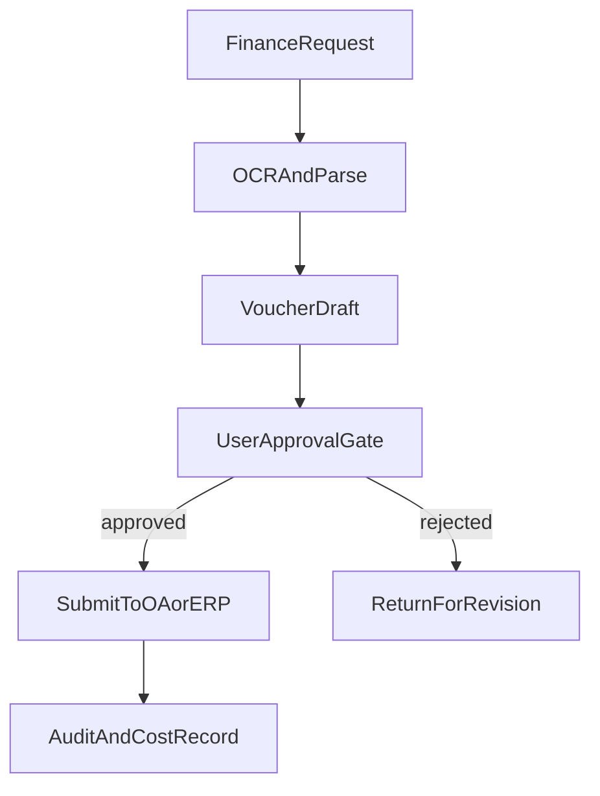

# 企业金融协作 Agent 一期架构方案（Windows 桌面）

## 1. 目标与边界

- 一期目标：交付可在 Windows 企业环境落地的桌面端，支持 9 类核心功能并具备可扩展能力。
- 技术路线：`Electron` 桌面容器 + `前端 Web UI` + `企业内网 Python Agent Gateway`。
- 核心原则：
  - LangChain + LangGraph + LangSmith 原生接入（流式、中断、审批输入、权限钩子、会话/检查点、工具生态、可观测）。
  - 业务域模块化（Skill/任务/日程/财务/个人助理/经营分析/企业知识库）
  - 多会话与任务状态统一事件流。

## 2. 桌面端技术方案

- 桌面应用：`Electron + Vue3 + TypeScript + Pinia + Vite`。
- 本地能力：
  - `Electron Main Process`：系统托盘、通知、自动更新、文件访问、凭证附件上传。
  - `Renderer`：多标签会话 UI、Skill 管理、市场、任务面板、审批弹窗、执行阶段右侧栏（Execution Stages）。
  - `Preload + IPC`：安全隔离，限制 Node 能力暴露面。
- 内网后端：`FastAPI + LangChain + LangGraph (Python)`，并通过 `LangSmith` 完成链路追踪与评估，对桌面端暴露统一 API。
- 数据层：
  - 服务端主库：`PostgreSQL`（会话、任务、Skill、市场、审计、财务业务数据）。
  - 可选缓存：`Redis`（流式会话态、定时任务锁、限流）。
  - 文件对象：`MinIO/企业NAS`（发票图像、附件、Skill 包）。

## 3. 推荐项目结构

- 桌面端
  - [desktop/electron/main.ts](desktop/electron/main.ts)
  - [desktop/electron/preload.ts](desktop/electron/preload.ts)
  - [desktop/ui/src/views/ChatView.vue](desktop/ui/src/views/ChatView.vue)
  - [desktop/ui/src/views/TaskCenterView.vue](desktop/ui/src/views/TaskCenterView.vue)
  - [desktop/ui/src/views/SkillMarketView.vue](desktop/ui/src/views/SkillMarketView.vue)
  - [desktop/ui/src/stores/session.store.ts](desktop/ui/src/stores/session.store.ts)
  - [desktop/ui/src/stores/task.store.ts](desktop/ui/src/stores/task.store.ts)
- 服务端
  - [server/app/main.py](server/app/main.py)
  - [server/app/api/chat.py](server/app/api/chat.py)
  - [server/app/api/skills.py](server/app/api/skills.py)
  - [server/app/api/tasks.py](server/app/api/tasks.py)
  - [server/app/api/finance.py](server/app/api/finance.py)
  - [server/app/agent/orchestrator.py](server/app/agent/orchestrator.py)
  - [server/app/agent/hooks.py](server/app/agent/hooks.py)
  - [server/app/agent/approval.py](server/app/agent/approval.py)
  - [server/app/scheduler/worker.py](server/app/scheduler/worker.py)
  - [server/app/repositories/*.py](server/app/repositories)
  - [server/migrations/](server/migrations)
  - [server/tests/](server/tests)

## 4. 模块划分（按领域）

- `ConversationDomain`：普通对话、多会话、上下文窗口、文件检查点、Token/Cost 计量。
- `SkillDomain`：Skill 创建、安装、启停、版本、依赖、权限声明。
- `MarketDomain`：Skill 市场检索、详情、评分、安装审批、签名校验。
- `TaskDomain`：新建任务、任务上下文继承、执行状态机、待办事项列表。
- `ScheduleDomain`：Cron/一次性定时、重试、失败告警、执行日志。
- `FinanceDomain`：发票报销（OCR→解析→凭证→审批→提交）。
- `AssistantDomain`：个人助理（日程/提醒/邮件草稿/知识问答）。
- `BizInsightDomain`：企业经营数据查询、指标解释、图表摘要与告警。
- `KnowledgeBaseDomain`：企业知识库（文档采集、切片索引、权限检索、RAG 引用与溯源）。
- `PolicyAndAuditDomain`：权限处理、用户审批输入、Hook 策略、操作审计。

## 5. LangChain + LangGraph + LangSmith 能力映射

- 流式输出：`/chat/stream` 使用 SSE/WebSocket 推送 token、tool_event、cost_event（LangChain `stream` + callback）。
- 中断/恢复：基于 LangGraph `interrupt` + `checkpointer`（Postgres/Redis）实现会话级暂停、审批后恢复与断点续跑。
- 处理权限：Tool 调用前通过中间件/回调触发 `permission_hook`，高风险工具走审批分支。
- 用户审批输入：财务提交、市场安装、外部系统写操作通过 LangGraph HITL 节点进入 Approval Gate。
- 钩子：LangChain callbacks + LangGraph node hooks 用于 `before_tool`/`after_tool`/`on_error`/`on_cost` 策略控制和审计。
- 会话管理：LangGraph 状态机维护会话树（父子任务会话）、上下文摘要、长期记忆索引。
- 文件检查点：每次关键操作落 checkpoint（prompt、tool_result、voucher_snapshot），由 checkpointer 持久化。
- 托管与待办：任务中心对接 LangGraph 状态节点与待执行边，展示可执行步骤与状态。
- 成本与用量追踪：按用户/会话/技能聚合 token、费用、延迟（LangSmith trace + usage 聚合）。
- 插件/工具：Skill Runtime 统一适配 LangChain Tools 协议与内部工具注册中心。
- 知识检索工具：通过 LangChain tool/retriever 挂载 `kb.search/kb.get_document/kb.update_index`。
- 观测与评估：LangSmith 统一采集 trace、会话重放、线上评估与回归对比。

## 6. 核心流程设计






## 6.1 执行阶段右侧栏（CoWork 风格）设计

- 阶段模型：将 LangGraph 节点映射为右侧栏阶段（如 `planner`、`policy_guard`、`approval_gate`、`tool_executor`、`responder`）。
- 阶段状态：`pending / running / waiting_human / completed / failed`。
- 事件驱动：后端通过 SSE 推送 `stage_started / stage_progress / stage_waiting_human / stage_completed / stage_failed`。
- 交互恢复：当阶段为 `waiting_human`，右侧栏内联展示审批/补充输入，提交后调用 `POST /api/v1/chat/resume`。
- 可观测联动：阶段记录 `trace_id`，支持跳转 LangSmith trace 进行审计与回放。
- 展示字段：`stage_key`、`stage_label`、`started_at`、`ended_at`、`duration_ms`、`tool_name`、`summary`、`error`。


## 7. 数据表设计（一期核心）

- `users`：用户、部门、角色、状态、最后登录。
- `sessions`：会话主表（类型 chat/task/finance/assistant/biz、标题、owner、status）。
- `session_messages`：消息明细（role、content、tool_calls、stream_chunks、token_usage）。
- `session_checkpoints`：关键检查点（step、payload、resume_token、created_at）。
- `skills`：Skill 元数据（name、version、author、runtime、entrypoint、permission_scope）。
- `skill_installs`：安装实例（user_id/tenant_id、enabled、config_json、installed_from）。
- `skill_market_items`：市场条目（发布者、签名、评分、下载量、审计状态）。
- `tasks`：任务主表（parent_session_id、priority、due_at、state、assignee）。
- `task_runs`：任务执行记录（run_id、trigger、input、output、error、cost）。
- `schedules`：定时计划（cron_expr、timezone、next_run_at、retry_policy）。
- `schedule_runs`：计划执行日志（status、duration_ms、attempt、error）。
- `expense_claims`：报销单（claim_no、applicant、department、amount、status）。
- `expense_invoices`：发票明细（ocr_text、invoice_type、invoice_no、tax、total）。
- `vouchers`：凭证草稿/正式凭证（entries_json、balanced、approval_state、external_id）。
- `approvals`：审批记录（biz_type、target_id、approver、decision、comment）。
- `biz_datasets`：经营数据源注册（connector_type、schema、refresh_policy）。
- `biz_queries`：经营分析查询日志（query_text、sql_or_plan、result_ref、cost）。
- `kb_spaces`：知识空间（组织/部门/项目级隔离与可见性）。
- `kb_documents`：知识文档元数据（来源、版本、状态、标签、更新时间）。
- `kb_document_chunks`：文档切片与向量索引引用（chunk、embedding_ref、metadata）。
- `kb_connectors`：知识源连接器配置（SharePoint/Confluence/FS/DB 等）。
- `kb_sync_jobs`：知识同步任务与增量索引记录（状态、耗时、错误）。
- `kb_access_policies`：知识访问策略（角色/部门/用户到空间或文档授权）。
- `usage_metrics`：用量统计（user_id/session_id/skill_id、input_tokens、output_tokens、cost）。
- `audit_logs`：审计日志（actor、action、resource、risk_level、ip、trace_id）。

## 8. 接口设计（V1）

- 会话与对话
  - `POST /api/v1/sessions` 新建会话/任务会话
  - `GET /api/v1/sessions` 会话列表（分页、类型、状态）
  - `POST /api/v1/chat/stream` 流式对话（SSE）
  - `POST /api/v1/chat/interrupt` 中断当前流
  - `POST /api/v1/chat/resume` 从 checkpoint 恢复
  - `GET /api/v1/sessions/{id}/stages` 查询执行阶段快照（用于断线重连和页面初始化）
- Skill 管理与市场
  - `POST /api/v1/skills` 创建 Skill
  - `POST /api/v1/skills/install` 安装 Skill（触发审批）
  - `PATCH /api/v1/skills/{id}/enable` 启停 Skill
  - `GET /api/v1/market/skills` 市场列表
  - `GET /api/v1/market/skills/{id}` 市场详情
- 任务与定时
  - `POST /api/v1/tasks` 新建任务
  - `POST /api/v1/tasks/{id}/run` 手动执行
  - `POST /api/v1/schedules` 创建定时
  - `GET /api/v1/schedules/{id}/runs` 执行记录
- 财务报销
  - `POST /api/v1/finance/claims` 创建报销单
  - `POST /api/v1/finance/claims/{id}/invoices` 上传发票+OCR
  - `POST /api/v1/finance/claims/{id}/voucher/preview` 生成凭证预览
  - `POST /api/v1/finance/claims/{id}/submit` 审批后提交 OA/ERP
- 个人助理与经营数据
  - `POST /api/v1/assistant/actions` 助理动作执行
  - `POST /api/v1/biz/query` 经营数据问答/分析
- 企业知识库
  - `POST /api/v1/kb/spaces` 创建知识空间
  - `POST /api/v1/kb/documents/import` 导入知识文档（文件/URL/连接器）
  - `GET /api/v1/kb/documents/search` 检索知识片段（权限过滤）
  - `POST /api/v1/kb/index/rebuild` 触发重建或增量索引
- 审批、权限、审计
  - `POST /api/v1/approvals/request`
  - `POST /api/v1/approvals/{id}/decision`
  - `GET /api/v1/usage/summary` 成本与用量统计
  - `GET /api/v1/audit/logs` 审计检索

## 8.1 前端执行阶段数据契约（Pinia）

- Store 建议：`desktop/ui/src/stores/stage.store.ts`（按 `session_id + thread_id` 维度维护阶段状态）。
- 核心结构：
  - `runsByThread: Record<string, StageRunState>`
  - `StageRunState`：`run_id`、`status`、`trace_id`、`stages[]`、`last_event_id`、`updated_at`
  - `StageItem`：`stage_key`、`stage_label`、`status`、`started_at`、`ended_at`、`duration_ms`、`tool_name`、`summary`、`error`
- 事件处理：
  - `stage_started`：若阶段不存在则创建并标记 `running`。
  - `stage_progress`：更新 `summary` 与可选 `percent`。
  - `stage_waiting_human`：阶段置为 `waiting_human` 并挂载 `approval_payload`。
  - `stage_completed`：填充 `ended_at/duration_ms`，状态置为 `completed`。
  - `stage_failed`：记录错误并置为 `failed`。
  - `completed`：运行状态置 `completed`，写入 `final_answer`。
- 去重策略：使用 `event_id`（或 `run_id + stage_key + event_type + ts`）实现幂等更新，忽略重复事件。
- 重连策略：
  - SSE 断开后指数退避重连（1s/2s/4s/8s，上限 30s）。
  - 重连后优先调用 `GET /api/v1/sessions/{id}/stages` 回补快照，再续接流。
  - 使用 `last_event_id` 或 `updated_after` 参数减少重复回放。
- 顺序保证：前端按 `server_ts` 排序落库，避免网络抖动导致阶段倒序展示。

## 8.2 右侧栏交互动作约定

- `继续执行`：当存在 `waiting_human` 阶段，提交用户输入到 `POST /api/v1/chat/resume`。
- `中断执行`：调用 `POST /api/v1/chat/interrupt`，运行状态置 `interrupted`。
- `查看详情`：展开阶段面板展示输入摘要、输出摘要、错误与耗时。
- `查看链路`：点击 trace 按钮跳转 LangSmith（通过 `trace_id`）。
- `重试失败阶段`：触发后端补偿/重跑接口（一期可先复用 `resume` + 指令参数）。
- `导出审计记录`：按 `run_id` 导出阶段事件与审批记录（一期可后端生成 JSON）。

## 9. 非功能与安全

- 鉴权：企业 SSO/OIDC，桌面端持有短期访问令牌 + 刷新机制。
- 权限模型：RBAC + 资源级策略（Skill 安装、财务提交、数据集访问）。
- 数据安全：传输 TLS、敏感字段加密（凭证/票据号/Token）、审计不可篡改。
- 稳定性：幂等提交、任务重试、断线重连、流式超时回收。
- 可观测性：OpenTelemetry + Prometheus + 结构化日志 + trace_id 全链路。

## 9.1 流式事件协议（执行阶段）

- `token`：增量文本片段。
- `tool_event`：工具开始/结束与结果摘要。
- `stage_started`：阶段开始，载荷包含 `stage_key`、`stage_label`、`started_at`。
- `stage_progress`：阶段进度更新，载荷包含 `summary`、`percent`（可选）。
- `stage_waiting_human`：进入人工确认，载荷包含 `approval_payload`。
- `stage_completed`：阶段完成，载荷包含 `ended_at`、`duration_ms`、`summary`。
- `stage_failed`：阶段失败，载荷包含 `error_code`、`error_message`。
- `cost_event`：累计 token/cost 更新。
- `completed`：整次运行完成，返回 `final_answer` 与阶段汇总。

## 9.2 事件 JSON 示例（前后端联调）

- 通用信封（所有事件一致）：

```json
{
  "event_id": "evt_20260401_000001",
  "event_type": "stage_started",
  "session_id": "sess_001",
  "thread_id": "thread_001",
  "run_id": "run_001",
  "trace_id": "trace_001",
  "server_ts": "2026-04-01T10:00:00Z",
  "payload": {}
}
```

- `stage_started`：

```json
{
  "event_id": "evt_20260401_000010",
  "event_type": "stage_started",
  "session_id": "sess_001",
  "thread_id": "thread_001",
  "run_id": "run_001",
  "trace_id": "trace_001",
  "server_ts": "2026-04-01T10:00:01Z",
  "payload": {
    "stage_key": "planner",
    "stage_label": "任务规划",
    "status": "running",
    "started_at": "2026-04-01T10:00:01Z"
  }
}
```

- `stage_progress`：

```json
{
  "event_id": "evt_20260401_000011",
  "event_type": "stage_progress",
  "session_id": "sess_001",
  "thread_id": "thread_001",
  "run_id": "run_001",
  "trace_id": "trace_001",
  "server_ts": "2026-04-01T10:00:02Z",
  "payload": {
    "stage_key": "planner",
    "summary": "识别到需要调用 OCR 与财务校验工具",
    "percent": 40
  }
}
```

- `stage_waiting_human`（等价审批/提问）：

```json
{
  "event_id": "evt_20260401_000020",
  "event_type": "stage_waiting_human",
  "session_id": "sess_001",
  "thread_id": "thread_001",
  "run_id": "run_001",
  "trace_id": "trace_001",
  "server_ts": "2026-04-01T10:00:05Z",
  "payload": {
    "stage_key": "approval_gate",
    "stage_label": "人工确认",
    "status": "waiting_human",
    "approval_payload": {
      "biz_type": "finance_submit",
      "target_id": "claim_20260401_01",
      "question": "检测到金额差异 120.50 元，是否继续提交？",
      "options": ["approve", "reject", "revise"]
    }
  }
}
```

- `stage_completed`：

```json
{
  "event_id": "evt_20260401_000030",
  "event_type": "stage_completed",
  "session_id": "sess_001",
  "thread_id": "thread_001",
  "run_id": "run_001",
  "trace_id": "trace_001",
  "server_ts": "2026-04-01T10:00:09Z",
  "payload": {
    "stage_key": "tool_executor",
    "status": "completed",
    "tool_name": "finance.submit_voucher",
    "summary": "凭证已提交至 ERP，返回 external_id=ERP-98421",
    "started_at": "2026-04-01T10:00:06Z",
    "ended_at": "2026-04-01T10:00:09Z",
    "duration_ms": 3000
  }
}
```

- `stage_failed`：

```json
{
  "event_id": "evt_20260401_000031",
  "event_type": "stage_failed",
  "session_id": "sess_001",
  "thread_id": "thread_001",
  "run_id": "run_001",
  "trace_id": "trace_001",
  "server_ts": "2026-04-01T10:00:10Z",
  "payload": {
    "stage_key": "tool_executor",
    "status": "failed",
    "error_code": "ERP_TIMEOUT",
    "error_message": "ERP 网关超时，请稍后重试",
    "retryable": true
  }
}
```

- `token`（可选最小格式）：

```json
{
  "event_id": "evt_20260401_000040",
  "event_type": "token",
  "session_id": "sess_001",
  "thread_id": "thread_001",
  "run_id": "run_001",
  "trace_id": "trace_001",
  "server_ts": "2026-04-01T10:00:11Z",
  "payload": {
    "text": "已为你完成提交，正在汇总结果。"
  }
}
```

- `cost_event`：

```json
{
  "event_id": "evt_20260401_000050",
  "event_type": "cost_event",
  "session_id": "sess_001",
  "thread_id": "thread_001",
  "run_id": "run_001",
  "trace_id": "trace_001",
  "server_ts": "2026-04-01T10:00:12Z",
  "payload": {
    "input_tokens": 1240,
    "output_tokens": 318,
    "total_tokens": 1558,
    "total_cost": 0.0231,
    "currency": "USD"
  }
}
```

- `completed`：

```json
{
  "event_id": "evt_20260401_000060",
  "event_type": "completed",
  "session_id": "sess_001",
  "thread_id": "thread_001",
  "run_id": "run_001",
  "trace_id": "trace_001",
  "server_ts": "2026-04-01T10:00:13Z",
  "payload": {
    "status": "completed",
    "final_answer": "报销流程已完成并提交 ERP。",
    "stage_summary": {
      "completed": 5,
      "failed": 0,
      "waiting_human": 0
    }
  }
}
```

- `error`（运行级失败）：

```json
{
  "event_id": "evt_20260401_000070",
  "event_type": "error",
  "session_id": "sess_001",
  "thread_id": "thread_001",
  "run_id": "run_001",
  "trace_id": "trace_001",
  "server_ts": "2026-04-01T10:00:14Z",
  "payload": {
    "status": "failed",
    "error_code": "GRAPH_RUNTIME_ERROR",
    "error_message": "状态图执行异常，已进入可恢复状态",
    "recoverable": true
  }
}
```

## 9.3 界面风格基线（参考 CoWork + Codex）

- 设计目标：在企业场景下保持“专业、稳定、可追踪”，兼顾 CoWork 的流程可视化与 Codex 的工程化信息密度。
- 信息架构：
  - 左栏：会话与任务导航（按类型/状态分组，支持快速筛选）。
  - 中栏：主对话区（流式输出、工具事件折叠、消息引用）。
  - 右栏：执行阶段面板（阶段状态、耗时、审批、错误、trace 跳转）。
- 视觉原则：
  - 默认浅色主题，提供深色主题；色彩优先中性灰阶 + 单一品牌强调色。
  - 强状态色仅用于执行状态（running/waiting/failed/success），避免大面积高饱和。
  - 间距与圆角统一（建议 8px 栅格，卡片圆角 8~10px）。
- 组件风格：
  - 对话消息气泡简洁，工具事件默认折叠为“事件卡片”。
  - 右栏阶段使用“时间线 + 状态徽标 + 可展开详情”。
  - 审批/AskUserQuestion 使用内联卡片，不打断主工作流。
- 交互准则：
  - 流式响应时固定滚动锚点，减少页面跳动。
  - 阶段更新采用增量动画（200~300ms），避免频繁重排。
  - 失败阶段提供明确下一步动作：重试、人工处理、查看审计。
- 文案与反馈：
  - 所有系统事件使用可操作文案（例如“等待你确认后继续提交”）。
  - 错误信息提供“用户可理解描述 + 技术错误码”。
  - 长任务显示预计耗时区间与最近进度时间戳。
- 可用性与可访问性：
  - 关键操作支持键盘快捷键（发送、停止、继续执行）。
  - 状态颜色需满足对比度要求，图标与文本双通道表达状态。
  - 右栏在窄屏自动折叠为抽屉，保证主对话可读性。
- 实施建议（一期）：
  - 先交付基础三栏布局 + 阶段时间线，再迭代动效与主题系统。
  - 与 `9.1/9.2` 事件协议强绑定，确保“事件即界面状态”一致性。

## 9.4 UI Design Tokens（一期草案）

- 颜色（Light）：
  - `--bg-app: #F7F8FA`
  - `--bg-panel: #FFFFFF`
  - `--bg-muted: #F1F3F6`
  - `--text-primary: #111827`
  - `--text-secondary: #4B5563`
  - `--text-tertiary: #9CA3AF`
  - `--border-default: #E5E7EB`
  - `--brand-primary: #2563EB`
- 状态色：
  - `--state-running: #2563EB`
  - `--state-waiting: #D97706`
  - `--state-success: #059669`
  - `--state-failed: #DC2626`
  - `--state-pending: #6B7280`
- 字体与排版：
  - `--font-family: Inter, "Segoe UI", "PingFang SC", sans-serif`
  - `--font-size-xs: 12px`
  - `--font-size-sm: 13px`
  - `--font-size-md: 14px`
  - `--font-size-lg: 16px`
  - `--line-height-tight: 1.4`
  - `--line-height-normal: 1.6`
- 间距与尺寸（8px 栅格）：
  - `--space-1: 4px`
  - `--space-2: 8px`
  - `--space-3: 12px`
  - `--space-4: 16px`
  - `--space-5: 20px`
  - `--space-6: 24px`
  - `--radius-sm: 6px`
  - `--radius-md: 8px`
  - `--radius-lg: 10px`
- 阴影与层级：
  - `--shadow-sm: 0 1px 2px rgba(16, 24, 40, 0.06)`
  - `--shadow-md: 0 6px 16px rgba(16, 24, 40, 0.10)`
  - `--z-header: 20`
  - `--z-drawer: 40`
  - `--z-modal: 60`
- 布局建议：
  - `--layout-left-width: 260px`
  - `--layout-right-width: 340px`
  - `--layout-center-min: 720px`
  - 窄屏（<1366）右栏切抽屉，默认收起。
- 动效：
  - `--motion-fast: 160ms`
  - `--motion-base: 240ms`
  - `--motion-slow: 320ms`
  - 推荐曲线：`cubic-bezier(0.2, 0, 0, 1)`
- 组件级 Token（关键）：
  - 消息卡片：`message-padding: 12px 14px`，`message-gap: 8px`
  - 阶段项：`stage-item-min-height: 56px`，`stage-dot-size: 8px`
  - 审批卡片：`approval-card-border: var(--state-waiting)`，按钮主色 `--brand-primary`
  - 错误卡片：背景使用 `#FEF2F2`，文字 `#991B1B`，边框 `#FCA5A5`
- 深色主题（一期可选）：
  - 建议采用同名 token 覆盖，不改组件语义变量，降低主题切换成本。

## 9.5 CSS 变量模板（可直接接入）

- 建议文件：`desktop/ui/src/styles/tokens.css`

```css
:root {
  /* Base */
  --bg-app: #f7f8fa;
  --bg-panel: #ffffff;
  --bg-muted: #f1f3f6;
  --text-primary: #111827;
  --text-secondary: #4b5563;
  --text-tertiary: #9ca3af;
  --border-default: #e5e7eb;
  --brand-primary: #2563eb;

  /* State */
  --state-running: #2563eb;
  --state-waiting: #d97706;
  --state-success: #059669;
  --state-failed: #dc2626;
  --state-pending: #6b7280;

  /* Typography */
  --font-family: Inter, "Segoe UI", "PingFang SC", sans-serif;
  --font-size-xs: 12px;
  --font-size-sm: 13px;
  --font-size-md: 14px;
  --font-size-lg: 16px;
  --line-height-tight: 1.4;
  --line-height-normal: 1.6;

  /* Spacing / Radius */
  --space-1: 4px;
  --space-2: 8px;
  --space-3: 12px;
  --space-4: 16px;
  --space-5: 20px;
  --space-6: 24px;
  --radius-sm: 6px;
  --radius-md: 8px;
  --radius-lg: 10px;

  /* Shadow / Layer */
  --shadow-sm: 0 1px 2px rgba(16, 24, 40, 0.06);
  --shadow-md: 0 6px 16px rgba(16, 24, 40, 0.1);
  --z-header: 20;
  --z-drawer: 40;
  --z-modal: 60;

  /* Layout */
  --layout-left-width: 260px;
  --layout-right-width: 340px;
  --layout-center-min: 720px;

  /* Motion */
  --motion-fast: 160ms;
  --motion-base: 240ms;
  --motion-slow: 320ms;
  --motion-ease: cubic-bezier(0.2, 0, 0, 1);

  /* Component */
  --message-padding: 12px 14px;
  --message-gap: 8px;
  --stage-item-min-height: 56px;
  --stage-dot-size: 8px;
  --approval-card-border: var(--state-waiting);
  --error-card-bg: #fef2f2;
  --error-card-text: #991b1b;
  --error-card-border: #fca5a5;
}

[data-theme="dark"] {
  --bg-app: #0b1220;
  --bg-panel: #111827;
  --bg-muted: #1f2937;
  --text-primary: #f3f4f6;
  --text-secondary: #d1d5db;
  --text-tertiary: #9ca3af;
  --border-default: #374151;
  --brand-primary: #60a5fa;

  --state-running: #60a5fa;
  --state-waiting: #f59e0b;
  --state-success: #34d399;
  --state-failed: #f87171;
  --state-pending: #9ca3af;

  --shadow-sm: 0 1px 2px rgba(0, 0, 0, 0.35);
  --shadow-md: 0 8px 24px rgba(0, 0, 0, 0.45);

  --error-card-bg: #3f1d1d;
  --error-card-text: #fecaca;
  --error-card-border: #b91c1c;
}
```

- 接入建议：
  - 在应用入口全局引入 `tokens.css`，业务组件仅消费语义 token。
  - 主题切换仅切换根节点属性：`document.documentElement.dataset.theme = "dark"`。
  - 执行阶段右栏与消息组件优先改造为 token 驱动，保证样式一致性。

## 10. 一期实施顺序（8-10周）

- `S1` 基础平台：登录鉴权、会话流式、中断/恢复、成本统计（LangGraph 基础状态图 + checkpoint + LangSmith tracing）。
- `S2` Skill 体系：创建/安装/管理 + 市场浏览与安装审批。
- `S3` 任务中心：新建任务、多会话上下文、定时任务与执行日志。
- `S4` 财务主链：发票报销全流程（OCR→凭证→审批→提交）。
- `S5` 助理、经营与知识库：个人助理动作、经营数据查询、企业知识库接入（首批连接器）。
- `S6` 安全与上线：审计完善、灰度发布、运维手册。

